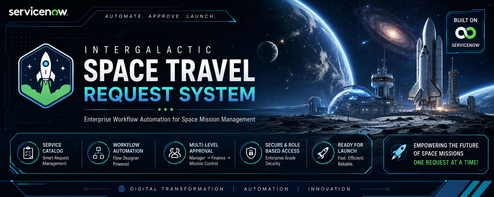
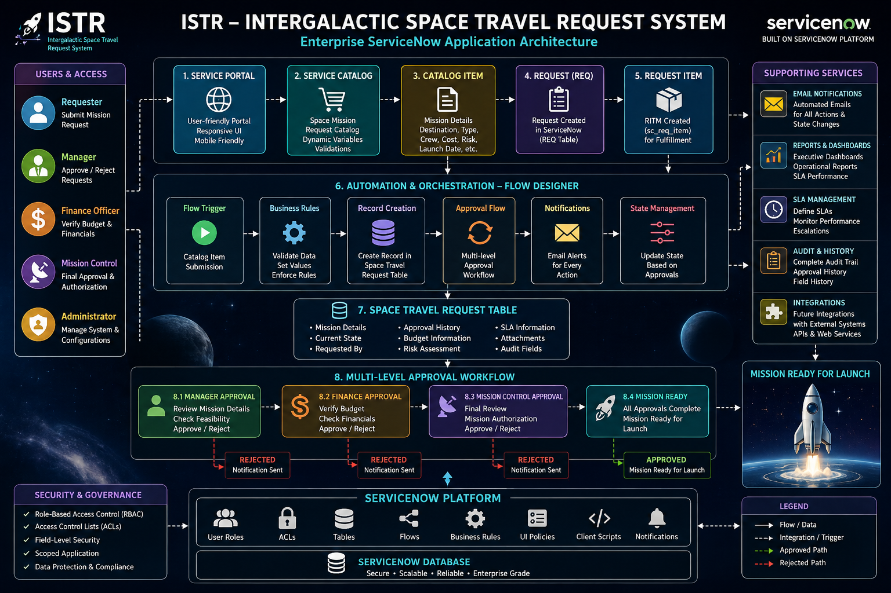
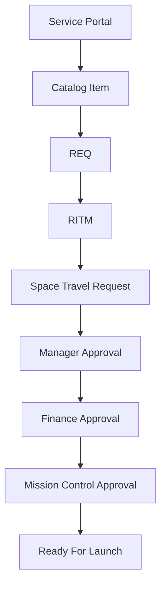
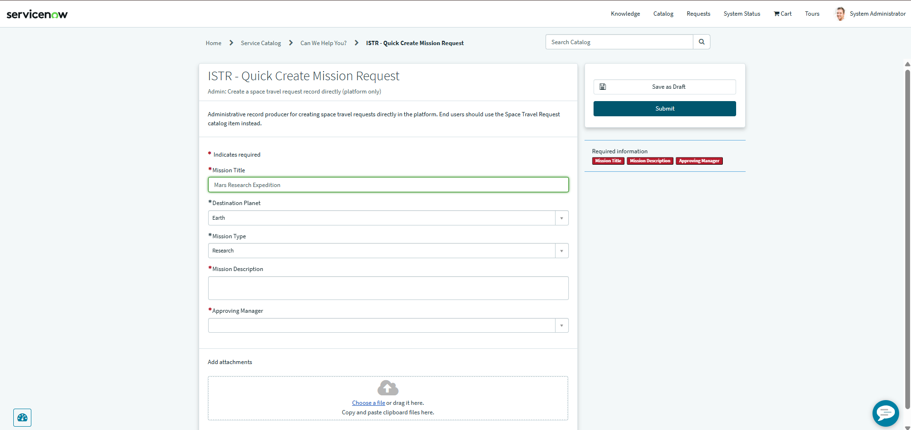
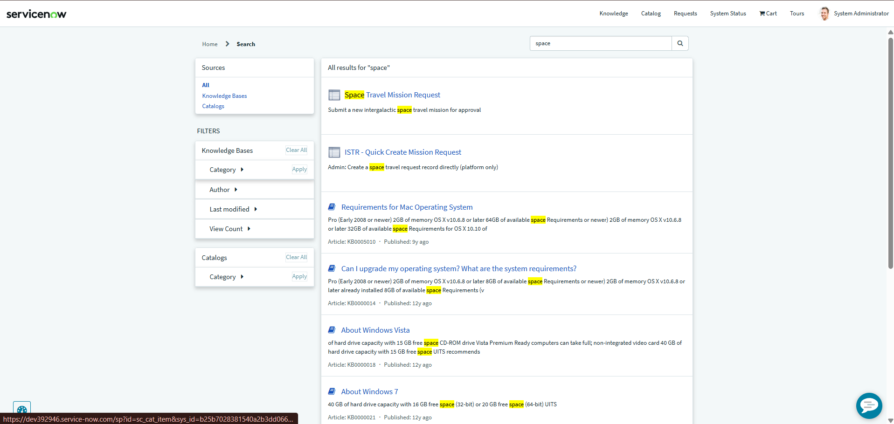
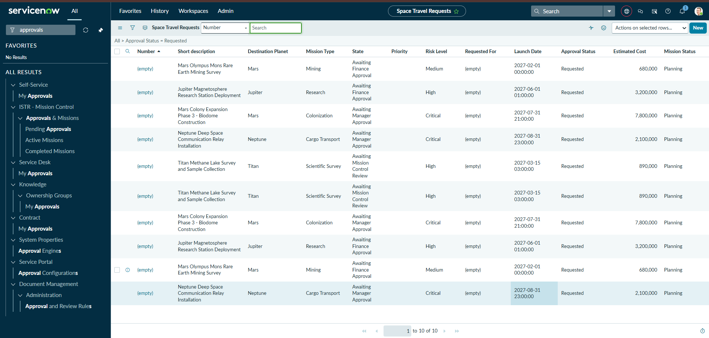
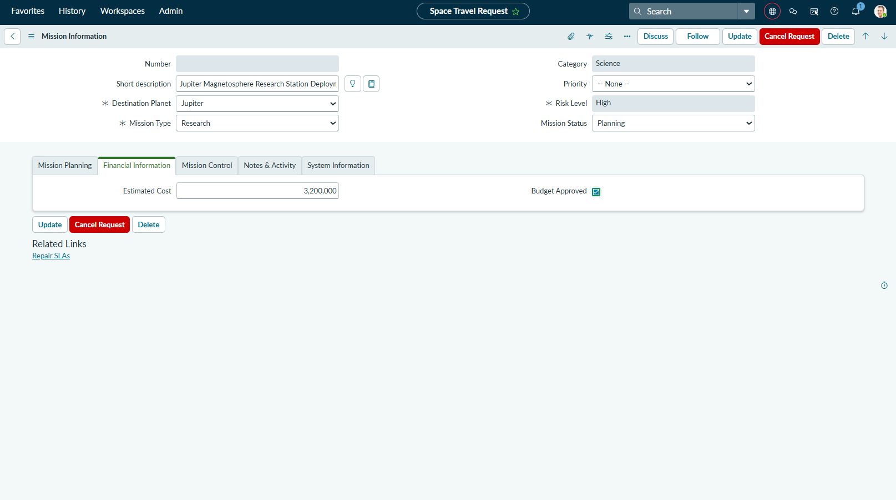
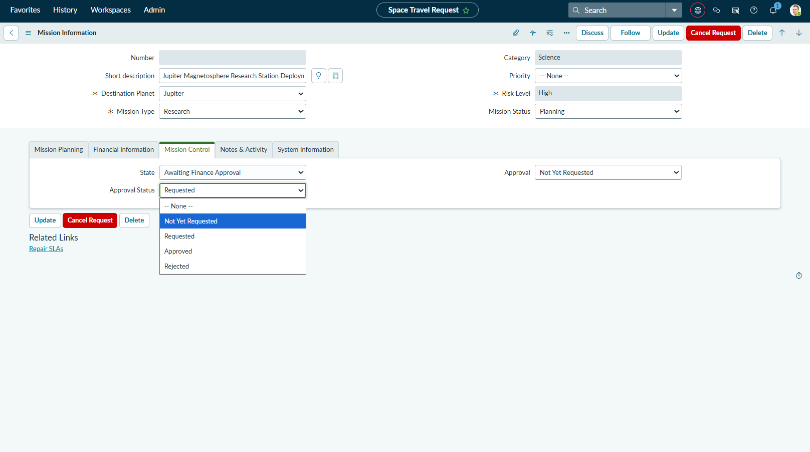

<div align="center">

# 🚀 Intergalactic Space Travel Request System (ISTR)

### *Enterprise Workflow Automation for Space Mission Management*

[](https://github.com/srujan66619/Intergalactic-Space-Travel-Request-System-ISTR-)



<br>

[](https://github.com/srujan66619)

[](https://github.com/srujan66619/Intergalactic-Space-Travel-Request-System-ISTR-/stargazers)
[](https://github.com/srujan66619/Intergalactic-Space-Travel-Request-System-ISTR-/network/members)
[](https://github.com/srujan66619/Intergalactic-Space-Travel-Request-System-ISTR-/issues)
[](https://github.com/srujan66619/Intergalactic-Space-Travel-Request-System-ISTR-/commits)

[](https://www.servicenow.com)
[](https://github.com/srujan66619/Intergalactic-Space-Travel-Request-System-ISTR-)
[](./LICENSE)

</div>

---

## Table of Contents

- [About](#about)
- [Project Highlights](#project-highlights)
- [System Architecture](#system-architecture)
- [Workflow](#workflow)
- [Tech Stack](#tech-stack)
- [Features](#features)
- [User Roles](#user-roles)
- [Project Structure](#project-structure)
- [Screenshots](#screenshots)
- [Installation](#installation)
- [Project Metrics](#project-metrics)
- [Security](#security)
- [Automation](#automation)
- [Reports](#reports)
- [Testing](#testing)
- [Future Enhancements](#future-enhancements)
- [GitHub Analytics](#github-analytics)
- [Author](#author)
- [Contributing](#contributing)
- [License](#license)
- [Footer](#footer)

---

# 🌌 About the Project

The **Intergalactic Space Travel Request System (ISTR)** is a modern enterprise workflow automation solution built on the **ServiceNow Platform** as a university capstone project.

ISTR automates the complete lifecycle of intergalactic mission requests — from request submission through multi-level approvals — ensuring secure, efficient, and transparent mission management. The application demonstrates Service Portal design, Flow Designer orchestration, Service Catalog best practices, and enterprise-grade security via scoped ACLs.

### Problem statement
Organizations that manage complex, multi-actor approvals (budget owners, line managers, operations) need dependable automation, auditability, SLA tracking and role-based data protection. Manual or ad-hoc processes introduce delays, compliance gaps, and poor traceability.

### Solution
ISTR provides a catalog-driven request entry point and a robust backend (custom tables, flows, business rules, notifications, ACLs and dashboards) to automate the full mission request lifecycle. The system enforces approvals, budget verification, and final operational signoff while preserving audit trails and SLA monitoring.

### Business value
- Faster decision cycles through automated routing and escalations
- Enforced separation of duties and robust RBAC
- Centralized reporting and SLA visibility for operations and finance
- Reusable enterprise patterns implemented on ServiceNow (scoped app, flows, ATF tests)

---

# 🎯 Objectives

| Objective | Details |
|---|---|
| 🚀 Automate Space Travel Requests | End-to-end automation from submission to fulfillment |
| 👨‍💼 Multi-Level Approval Workflow | Manager → Finance → Mission Control approval chain |
| 💰 Finance Validation | Budget checks and holds integrated into flows |
| 🛰️ Mission Control Authorization | Operational verification and final signoff |
| 🔒 Role-Based Security | Scoped ACLs and least-privilege roles |
| 📈 Workflow Automation | Flow Designer, business rules, and scheduled jobs |
| ⚡ Faster Decision Making | Notifications, SLAs and escalation policies |
| 🌍 Digital Transformation | Enterprise-grade process modernization on ServiceNow |

---

# ✨ Project Highlights

| Area | Included |
|---|---|
| Application type | Enterprise Scoped ServiceNow application (Update Set / scoped app exports) |
| Catalog | Catalog item for Space Travel Request with dynamic variables and validations |
| Orchestration | Flow Designer flows for approval routing and fulfillment |
| UX | Service Portal widgets and responsive forms |
| Security | Roles, field-level ACLs, and scoped configuration |
| Automation | Business Rules, Scheduled Jobs, and Flow Designer automations |
| Notifications | Template-driven email events for lifecycle actions |
| Observability | Reports, Dashboards, SLA monitoring |
| Testing | ATF (Automated Test Framework) coverage for critical flows |

---

# ⚙️ System Architecture

```
                   SERVICE PORTAL
                         │
                         ▼
                  SERVICE CATALOG
                         │
                         ▼
                      REQUEST
                         │
                         ▼
                    REQUEST ITEM
                         │
                         ▼
             CATALOG FULFILLMENT FLOW
                         │
                         ▼
          SPACE TRAVEL REQUEST RECORD
                         │
                         ▼
                 MANAGER APPROVAL
                         │
                         ▼
                 FINANCE APPROVAL
                         │
                         ▼
            MISSION CONTROL APPROVAL
                         │
                         ▼
                 READY FOR LAUNCH 🚀
```



> Architecture image placeholder: docs/images/architecture.png (preserve your actual image path)

---

# 🔄 Workflow



---

# 👥 User Roles

| Role | Responsibility |
|---|---|
| 👤 Requester | Submit Mission Requests |
| 👨‍💼 Manager | First Level Approval |
| 💰 Finance Officer | Budget Verification |
| 🛰️ Mission Control | Final Approval |
| 👨‍💻 Administrator | Manage Application |

---

# 🛠️ Technology Stack

| Layer | Technology | Purpose |
|---|---:|---|
| Platform |  ServiceNow | Enterprise platform and scoped application host |
| Orchestration | Flow Designer | Approval & fulfillment orchestration |
| UI | Service Portal | Portal UX and catalog experience |
| Catalog | Service Catalog | Mission request item and variables |
| Automation | Business Rules / Scheduled Jobs | Server-side automation and maintenance |
| Testing | ATF (Automated Test Framework) | Regression and critical-path tests |
| Observability | Reports & Dashboards | Executive and operational insights |

---

# 📦 Features

| Feature | Summary |
|---|---|
| Service Portal | User-friendly portal with responsive design for request submission |
| Service Catalog | Dynamic catalog item, client validation, UI policies, and fulfillment |
| Workflow Automation | Flow Designer flows, conditional routing, automated state updates |
| Security | Scoped application with role-based ACLs and field-level protection |
| Notifications | Email templates for approvals, rejections, escalations and fulfillment |
| Reports & Dashboards | Pre-built reports and executive dashboard for SLA and operations |
| SLAs | Time-based SLA definitions with escalation flows |
| ATF | Automated Test Framework tests for core flows and business rules |

---

# 📂 Project Structure

```
ISTR/

├── docs/
│   ├── banner.png
│   ├── images/
│   ├── architecture.png
│   ├── workflow.png
│   └── demo.gif
│
├── update_sets/
│
├── application/
│
├── README.md
│
└── LICENSE
```

---

# 📸 Screenshots

## 🏠 Service Portal



---

## 📝 Catalog Item



---

## 👨‍💼 Manager Approval



---

## 💰 Finance Approval



---

## 🛰️ Mission Control Approval



---

# 🚀 Installation

Follow these steps to install ISTR into a ServiceNow instance. This section assumes you have administrative access to a developer or sandbox instance.

### Prerequisites
- ServiceNow instance (developer or scoped instance) with admin privileges
- Confirm ServiceNow release compatibility (check application manifest or notes)
- An account with Update Set import and app installation permissions

### Clone
```bash
git clone https://github.com/srujan66619/Intergalactic-Space-Travel-Request-System-ISTR-.git
cd Intergalactic-Space-Travel-Request-System-ISTR-
```

### Import Update Set
1. In ServiceNow: System Update Sets → Retrieved Update Sets → Import Update Set from XML
2. Upload the XML from update_sets/ or from the MISSION-REQUEST-SYSTEM export
3. Preview the Update Set, resolve any conflicts, then Commit

### Activate & Publish
- Open Studio → Open the imported scoped application
- Flow Designer → Publish all exported flows
- Notifications → Verify email/SN SMTP configuration and test templates
- Reports/Dashboards → Confirm data sources and permissions

### Roles & ACLs
- Create/assign roles included in the application (Requester, Manager, Finance, Mission Control, Admin)
- Verify ACL behavior using test accounts for each role

### Validate
- Submit a test mission via Service Portal
- Progress the request through Manager → Finance → Mission Control approvals
- Confirm notifications, SLA timers and dashboard updates

Notes
- Use instance change control and testing before deploying to production
- Add ATF tests to the instance test plan for CI pipelines

---

# 🎥 Demo

> Add your YouTube demo link here

```text
https://youtu.be/YOUR_VIDEO_LINK
```

---

# 📈 Future Enhancements

- 🤖 AI Risk Prediction
- 🚀 Rocket Allocation
- 👨‍🚀 Astronaut Assignment
- 📄 PDF Reports
- 📊 Dashboards
- 📧 Smart Notifications
- 🌍 Planet Distance API
- 📱 Mobile App
- 🔔 Real-Time Alerts
- 🌐 REST API Integration

---

# 📊 GitHub Statistics

<div align="center">


</div>

---

# 🔥 GitHub Streak

<div align="center">


</div>

---

# 📈 Contribution Graph

<div align="center">


</div>

---

# 🏆 GitHub Trophies

<div align="center">


</div>

---

# 📚 Learning Outcomes

This project demonstrates hands-on experience in:

- Enterprise Workflow Automation
- ServiceNow Development
- Flow Designer
- Service Catalog
- Service Portal
- Role-Based Access Control
- Approval Management
- Custom Application Development

---

# 🤝 Contributing

Contributions are welcome.

1. Fork the repository

2. Create a Feature Branch

```bash
git checkout -b feature-name
```

3. Commit Changes

```bash
git commit -m "Added new feature"
```

4. Push Changes

```bash
git push origin feature-name
```

5. Create a Pull Request

---

# 📜 License

This project is licensed under the **MIT License**.

---

# 👨‍💻 Author

## **Srujan Sinha Parasa**

🎓 Computer Science Engineering Student

💼 ServiceNow Developer

🤖 AI & Workflow Automation Enthusiast

🚀 Open Source Learner

### 🌐 Connect With Me

- GitHub: https://github.com/srujan66619
- LinkedIn: *(Add your LinkedIn profile URL here)*
- Email: *(Add your email here)*

---

# ⭐ Support

If you found this project useful:

⭐ Star this repository

🍴 Fork it

💡 Share your feedback

---

<div align="center">

# 🚀 "Automating Tomorrow's Space Missions with ServiceNow"

### Made with ❤️ using ServiceNow

</div>
