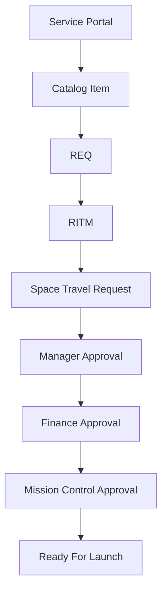

<div align="center">

# 🚀 Intergalactic Space Travel Request System (ISTR)

### *Enterprise Workflow Automation for Space Mission Management*

[](https://git.io/typing-svg)


<br>


</div>

---

# 🌌 About the Project

The **Intergalactic Space Travel Request System (ISTR)** is a modern enterprise workflow automation solution developed on the **ServiceNow Platform**.

The system automates the complete lifecycle of intergalactic mission requests—from request submission through multi-level approvals—ensuring secure, efficient, and transparent mission management.

Designed as a hackathon-ready enterprise application, ISTR showcases workflow automation, Service Portal development, Flow Designer, Service Catalog, role-based security, and scalable approval processes.

---

# 🎯 Objectives

- 🚀 Automate Space Travel Requests
- 👨‍💼 Multi-Level Approval Workflow
- 💰 Finance Validation
- 🛰️ Mission Control Authorization
- 🔒 Role-Based Security
- 📈 Workflow Automation
- ⚡ Faster Decision Making
- 🌍 Digital Transformation

---

# ✨ Features

## 🌐 Service Portal

- User-friendly Portal
- Responsive Design
- Easy Mission Submission
- Mobile Friendly

---

## 📦 Service Catalog

- Space Mission Request Catalog
- Dynamic Variables
- Client Validation
- UI Policies
- Catalog Fulfillment

---

## ⚙️ Workflow Automation

- Flow Designer
- Automated Request Creation
- Multi-Level Approval
- Conditional Routing
- Automated State Updates
- Notifications

---

## 🔒 Security

- Scoped Application
- Role-Based Access Control
- ACL Configuration
- Field-Level Security

---

## 📊 Mission Details

- Destination Planet
- Mission Type
- Launch Date
- Crew Size
- Estimated Cost
- Risk Level
- Mission Description
- Additional Notes

---

# 🏗️ System Architecture

```text
                   SERVICE PORTAL
                         │
                         ▼
                  SERVICE CATALOG
                         │
                         ▼
                      REQUEST
                         │
                         ▼
                    REQUEST ITEM
                         │
                         ▼
             CATALOG FULFILLMENT FLOW
                         │
                         ▼
          SPACE TRAVEL REQUEST RECORD
                         │
                         ▼
                 MANAGER APPROVAL
                         │
                         ▼
                 FINANCE APPROVAL
                         │
                         ▼
            MISSION CONTROL APPROVAL
                         │
                         ▼
                 READY FOR LAUNCH 🚀
```

---

# 🔄 Workflow



---

# 👥 User Roles

| Role | Responsibility |
|------|----------------|
| 👤 Requester | Submit Mission Requests |
| 👨‍💼 Manager | First Level Approval |
| 💰 Finance Officer | Budget Verification |
| 🛰️ Mission Control | Final Approval |
| 👨‍💻 Administrator | Manage Application |

---

# 🛠️ Technology Stack

| Technology | Purpose |
|------------|---------|
| ServiceNow | Enterprise Platform |
| Flow Designer | Workflow Automation |
| Service Portal | User Interface |
| Service Catalog | Request Management |
| Client Scripts | Validation |
| UI Policies | Dynamic Forms |
| ACL | Security |
| Notifications | Communication |
| Custom Tables | Data Management |

---

# 📂 Project Structure

```
ISTR/

├── docs/
│   ├── banner.png
│   ├── images/
│   ├── architecture.png
│   ├── workflow.png
│   └── demo.gif
│
├── update_sets/
│
├── application/
│
├── README.md
│
└── LICENSE
```

---

# 📸 Screenshots

## 🏠 Service Portal


---

## 📝 Catalog Item


---

## 👨‍💼 Manager Approval


---

## 💰 Finance Approval


---

## 🛰️ Mission Control Approval


---

# 🚀 Installation

```bash
git clone https://github.com/srujan66619/ISTR.git
```

Import into ServiceNow:

- Update Set
- Custom Application
- Flow Designer Flows
- Catalog Item
- Portal Components

Activate:

- Flow Designer
- Notifications
- ACLs
- UI Policies

---

# 🎥 Demo

> Add your YouTube demo link here

```text
https://youtu.be/YOUR_VIDEO_LINK
```

---

# 📈 Future Enhancements

- 🤖 AI Risk Prediction
- 🚀 Rocket Allocation
- 👨‍🚀 Astronaut Assignment
- 📄 PDF Reports
- 📊 Dashboards
- 📧 Smart Notifications
- 🌍 Planet Distance API
- 📱 Mobile App
- 🔔 Real-Time Alerts
- 🌐 REST API Integration

---

# 📊 GitHub Statistics

<div align="center">


</div>

---

# 🔥 GitHub Streak

<div align="center">


</div>

---

# 📈 Contribution Graph

<div align="center">


</div>

---

# 🏆 GitHub Trophies

<div align="center">


</div>

---

# 📚 Learning Outcomes

This project demonstrates hands-on experience in:

- Enterprise Workflow Automation
- ServiceNow Development
- Flow Designer
- Service Catalog
- Service Portal
- Role-Based Access Control
- Approval Management
- Custom Application Development

---

# 🤝 Contributing

Contributions are welcome.

1. Fork the repository

2. Create a Feature Branch

```bash
git checkout -b feature-name
```

3. Commit Changes

```bash
git commit -m "Added new feature"
```

4. Push Changes

```bash
git push origin feature-name
```

5. Create a Pull Request

---

# 📜 License

This project is licensed under the **MIT License**.

---

# 👨‍💻 Author

## **Srujan Sinha Parasa**

🎓 Computer Science Engineering Student

💼 ServiceNow Developer

🤖 AI & Workflow Automation Enthusiast

🚀 Open Source Learner

### 🌐 Connect With Me

- GitHub: https://github.com/srujan66619
- LinkedIn: *(Add your LinkedIn profile URL here)*
- Email: *(Add your email here)*

---

# ⭐ Support

If you found this project useful:

⭐ Star this repository

🍴 Fork it

💡 Share your feedback

---

<div align="center">

# 🚀 "Automating Tomorrow's Space Missions with ServiceNow"

### Made with ❤️ using ServiceNow

</div>
